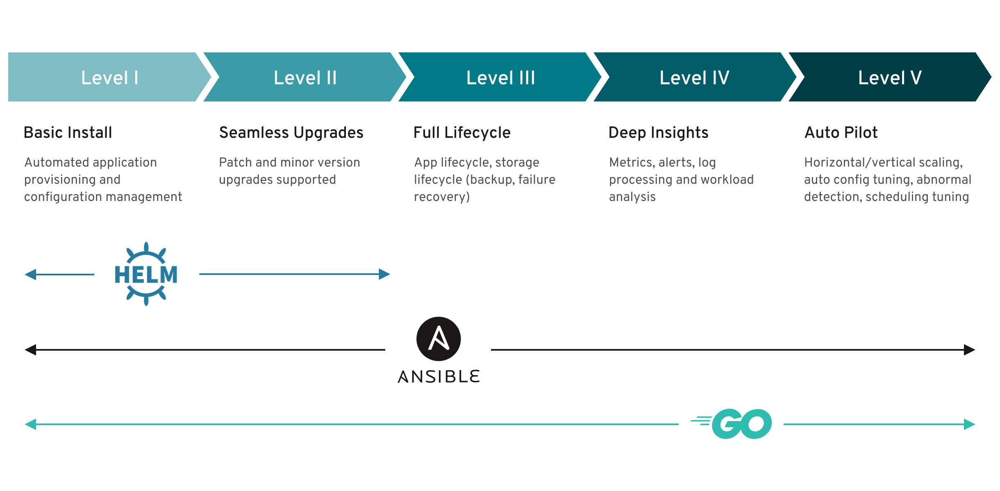

# Operator capability levels

These capabilities are implemented by the Multigres Operator, classified using
the [Operator SDK definition of Capability Levels](https://operatorframework.io/operator-capabilities/)
framework.

## Summary

| Level | Name | Status | Highlights |
|:------|:-----|:-------|:-----------|
| I | [Basic Install](#level-1-basic-install) | **Full** | 10 CRDs, mutating/validating webhooks (17 CEL rules), template resolution, hierarchical defaults, TLS management, status reporting |
| II | [Seamless Upgrades](#level-2-seamless-upgrades) | **Full** | Spec-hash rolling updates, drain state machine, primary-last ordering, SHA-pinned images, upgrade metrics and alerts |
| III | [Full Lifecycle](#level-3-full-lifecycle) | **Full** | pgBackRest backups (S3 + filesystem), backup health monitoring, 4-state drain machine, safe scale up/down, PDBs, graceful deletion ordering, PVC lifecycle policies |
| IV | [Deep Insights](#level-4-deep-insights) | **Full** | 12 Prometheus metrics, 10 alerts with runbooks, 3 Grafana dashboards, OpenTelemetry distributed tracing, structured JSON logging with log-trace correlation |
| V | [Auto Pilot](#level-5-auto-pilot) | **Partial** | Auto-healing (operator + upstream Multigres), cert auto-rotation, connection pool auto-tuning (upstream Multigres). Not yet: auto-scaling, PG parameter tuning, anomaly detection |

We consider this framework as a guide for current status and future work.

---

## Level 1: Basic install

Capability level 1 involves installing and configuring the operator and
provisioning the full Multigres stack declaratively.

### Operator deployment via declarative configuration

The operator is installed declaratively using Kustomize overlays. Available
overlays include `default` (with webhook), `no-webhook`,
`deploy-certmanager`, and `deploy-observability`. A `make build-installer`
target generates a single install manifest in `dist/`. For development, `make
kind-deploy` provisions a complete local environment.

### MultigresCluster deployment via declarative configuration

A complete Multigres deployment (cells, shards, topology servers, gateways,
orchestrators, pool pods) is defined through a single `MultigresCluster`
custom resource. The operator creates and manages the following Kubernetes
resources: `Pod`, `Deployment`, `StatefulSet`, `Service`, `ConfigMap`,
`Secret`, `PersistentVolumeClaim`, and `PodDisruptionBudget`.

### Custom Resource Definitions

The operator defines 10 CRDs:

| CRD | Description |
|:----|:------------|
| `MultigresCluster` | Top-level resource defining a complete Multigres deployment |
| `Cell` | Logical failure domain (maps to availability zone) |
| `TableGroup` | Groups shards under a database, manages shard lifecycle |
| `Shard` | Data plane for a single shard: pools, orchestrator, storage |
| `TopoServer` | Etcd-based topology server |
| `CoreTemplate` | Reusable template for core components (topo, admin) |
| `CellTemplate` | Reusable template for cell-level components (gateway) |
| `ShardTemplate` | Reusable template for shard-level components (pools, orch, backup) |

Child CRs (`Cell`, `Shard`, `TableGroup`, `TopoServer`) are fully managed by
the operator and protected from external modification by the validating
webhook.

### Template resolution and defaulting

A mutating admission webhook automatically resolves `CoreTemplate`,
`CellTemplate`, and `ShardTemplate` references, injecting defaults for:

- **Images**: All 7 component images (Postgres/pgctld, MultiOrch, MultiPooler,
  MultiGateway, MultiAdmin, MultiAdminWeb, Etcd) pinned to specific SHA digests
- **Replicas**: Etcd=3, MultiAdmin=1, MultiAdminWeb=1, Pool=1 per cell
- **Storage**: Etcd=2Gi, Pool data=1Gi
- **Resources**: CPU/memory requests and limits for all components
- **PVC deletion policy**: Defaults to Retain/Retain
- **System databases**: Mandatory "postgres" database injected automatically

### Webhook validation

A validating admission webhook enforces the API contract with 17 CEL
validation rules across all types, including:

- Zone/region mutual exclusivity
- Backup type consistency (S3 config required when type=s3)
- Pool name length limits (<63 characters)
- TopoServer config exclusivity
- Storage shrink prevention (PVC resize down rejected)
- Template deletion guards (prevents deleting templates referenced by clusters)

### Override of operand images

All component images can be overridden via the `ClusterImages` struct in the
`MultigresCluster` spec. The operator defaults to images pinned by SHA digest
for reproducibility. Both `imagePullPolicy` and `imagePullSecrets` are
configurable.

### Storage configuration

- **Pool data PVCs**: Per-pod persistent volumes with configurable size,
  storageClass, and accessModes (default 1Gi, ReadWriteOnce)
- **Shared backup PVCs**: Per-cell ReadWriteMany PVC shared across pool pods for
  filesystem-based pgBackRest backups
- **Etcd PVCs**: Persistent storage for topology server pods
- **PVC deletion policy**: Two-dimensional policy (WhenDeleted + WhenScaled),
  each Retain or Delete, with hierarchical inheritance
  (Shard > TableGroup > Cluster > Template > default)

### Service configuration

The operator creates three categories of services:

- **Pool headless services**: Per pool/cell for pod DNS resolution required by
  pgBackRest and multipooler discovery
- **MultiGateway services**: Per-cell ClusterIP exposing HTTP, gRPC, and
  Postgres ports
- **TopoServer services**: Client and peer services for etcd cluster
  communication

### Pod configuration

- **Affinity and anti-affinity**: User-provided rules propagated to pool pods,
  MultiOrch, and MultiGateway
- **Tolerations**: Propagated to all managed pods
- **NodeSelector**: Automatically injected from cell zone/region topology labels
- **Pod labels and annotations**: Propagated from MultigresCluster spec to all
  managed components
- **Security contexts**: Non-root (uid/gid 999), read-only root filesystem
- **Termination grace period**: 30 seconds for graceful multipooler connection
  drain

### TLS certificate management

- **Webhook PKI**: Auto-generated self-signed CA (10yr) and server
  certificates (1yr), with automatic caBundle patching
- **cert-manager integration**: Alternative deployment using cert-manager for
  webhook certificates
- **pgBackRest TLS**: Auto-generated or user-provided certificates for secure
  inter-node pgBackRest communication

### Status reporting

The operator continuously updates status on all CRs:

- **MultigresCluster**: Phase (Healthy/Progressing/Error/Deleting), conditions
  (Available, Progressing), per-cell and per-database status summaries
- **Shard**: Phase, conditions, per-cell pool status, PodRoles map
  (PRIMARY/REPLICA/DRAINED), LastBackupTime, LastBackupType
- **Cell/TableGroup/TopoServer**: Phase, conditions, ObservedGeneration
- All CRs expose Phase, Available, and Age via `kubectl get` print columns

### Convention over configuration

The operator follows convention-over-configuration principles. A minimal
`MultigresCluster` spec with just a database name and cell list is sufficient
to deploy a complete stack. Templates, image defaults, resource defaults, and
storage defaults are all applied automatically.

---

## Level 2: Seamless upgrades

Capability level 2 enables updates of the operator and the managed Multigres
components.

### Operator upgrade

Upgrading the operator is a standard Kubernetes deployment update. The
operator manages all operand versions through image references, so upgrading
the operator does not require changes to running operands.

### Rolling updates of pool pods

The operator implements a custom rolling update strategy using spec-hash
comparison:

1. Each pool pod receives a `multigres.com/spec-hash` annotation computed from
   its full desired spec (containers, volumes, affinity, tolerations,
   nodeSelector, env vars, resources)
2. On each reconcile, current hash is compared to desired hash to detect drift
3. Drifted pods are replaced one at a time through the drain state machine
4. Replicas are updated first, primary last (controlled switchover)
5. A `RollingUpdate` status condition tracks progress

### Image version management

The `ClusterImages` struct allows overriding all component images. Default
images are pinned to SHA digests (not floating tags) to ensure reproducible
deployments. Changing an image triggers the rolling update mechanism.

### TopoServer rolling updates

The etcd-based topology server uses the native Kubernetes
`RollingUpdateStatefulSetStrategy` for its StatefulSet pods.

### Upgrade observability

- `multigres_operator_pool_pods_drifted` gauge tracks pods pending update
- `multigres_operator_rolling_update_in_progress` gauge signals active rollouts
- `MultigresRollingUpdateStuck` alert fires when a rolling update exceeds 30
  minutes

---

## Level 3: Full lifecycle

Capability level 3 covers business continuity (backup, restore), safe scaling,
and graceful lifecycle management.

### Backup configuration

The operator supports pgBackRest-based backups with two storage backends:

- **Filesystem**: Shared ReadWriteMany PVC per cell, configurable size and
  storageClass
- **S3**: S3-compatible object storage with configurable bucket, endpoint,
  region, URI style, and credentials (via Secret reference or IRSA
  ServiceAccount)

Backup configuration supports hierarchical inheritance through templates
(Shard > TableGroup > Cluster > Template) via `MergeBackupConfig`.

### pgBackRest TLS

The operator auto-generates or accepts user-provided TLS certificates for
pgBackRest inter-node communication, supporting both ServerAuth and ClientAuth
extended key usages.

### Backup health monitoring

Backup freshness is continuously evaluated from shard status
`LastBackupTime`. The `multigres_operator_last_backup_age_seconds` metric
exposes per-shard backup age, and the `MultigresBackupStale` alert fires when
backup age exceeds 24 hours.

### Drain state machine

The operator implements a four-state drain machine for safe pod lifecycle
transitions:

1. **DrainStateRequested**: Pod marked for drain
2. **DrainStateDraining**: RPC sent to set NOT_SERVING in etcd topology
3. **DrainStateAcknowledged**: Drain confirmed in topology, connections drained
4. **DrainStateReadyForDeletion**: Safe to delete pod

Primary drain safety ensures replica drains are paused when the primary is
draining, preventing quorum loss. A 90-second timeout prevents indefinite
blocking on unresponsive pods.

### Scale up and down

- **Scale up**: New pool pods and PVCs created in parallel within a single
  reconcile pass and registered in topology
- **Scale down**: Excess pods routed through the drain state machine before
  deletion. Concurrent drain prevention via `inProgress` flag. PVC deleted if
  `WhenScaled=Delete`
- **Scale-down safety**: Blocked when pool is already degraded
  (`ScaleDownBlocked` event)

### PodDisruptionBudgets

Automatically created per pool/cell with `MaxUnavailable=1` to limit voluntary
evictions during node maintenance.

### Deletion ordering

- **Shard pending deletion**: `PendingDeletion` annotation triggers graceful
  drain of all pods; the TableGroup controller waits for `ReadyForDeletion`
  condition
- **Orphan TableGroup/Cell deletion**: Orphaned TableGroups and Cells removed
  from the spec follow the same `PendingDeletion` → `ReadyForDeletion` flow,
  routing through the drain state machine to prevent data loss
- **Owner references**: All child resources use controller owner references for
  Kubernetes garbage collection cascade

### PVC lifecycle management

Two-dimensional PVC deletion policy:

| Policy | Retain (default) | Delete |
|:-------|:-----------------|:-------|
| **WhenDeleted** | PVCs kept after Shard deletion | PVCs removed with Shard |
| **WhenScaled** | PVCs kept after scale-down | PVCs removed for DRAINED pods |

---

## Level 4: Deep insights

Capability level 4 covers observability: monitoring, alerting, tracing, and
structured logging.

### Prometheus metrics

The operator exposes 12 custom metrics plus standard controller-runtime
metrics:

| Metric | Type | Description |
|:-------|:-----|:------------|
| `multigres_operator_cluster_info` | Gauge | Cluster metadata (name, namespace, phase) |
| `multigres_operator_cluster_cells_total` | Gauge | Number of cells per cluster |
| `multigres_operator_cluster_shards_total` | Gauge | Number of shards per cluster |
| `multigres_operator_cell_gateway_replicas` | Gauge | Gateway replicas by state (desired/ready) |
| `multigres_operator_shard_pool_replicas` | Gauge | Pool replicas by state (desired/ready) |
| `multigres_operator_pool_pods_drifted` | Gauge | Pods pending rolling update |
| `multigres_operator_toposerver_replicas` | Gauge | TopoServer replicas by state |
| `multigres_operator_webhook_request_total` | Counter | Webhook requests by operation and result |
| `multigres_operator_webhook_request_duration_seconds` | Histogram | Webhook request latency |
| `multigres_operator_last_backup_age_seconds` | Gauge | Time since last backup per shard |
| `multigres_operator_drain_operations_total` | Counter | Drain operations by outcome |
| `multigres_operator_rolling_update_in_progress` | Gauge | Active rolling updates |

A `ServiceMonitor` scrapes the `/metrics` endpoint over HTTPS with bearer
token authentication.

### Alerting rules

10 PrometheusRule alerts with dedicated runbooks:

| Alert | Severity | Description |
|:------|:---------|:------------|
| `MultigresClusterReconcileErrors` | warning | Reconcile error rate > 0 for 5m |
| `MultigresClusterDegraded` | warning | Cluster phase != Healthy for 10m |
| `MultigresCellGatewayUnavailable` | **critical** | Zero ready gateway replicas for 5m |
| `MultigresShardPoolDegraded` | warning | Ready < desired pool replicas for 10m |
| `MultigresWebhookErrors` | warning | Webhook error rate > 0 for 5m |
| `MultigresBackupStale` | warning | Backup age > 24 hours for 30m |
| `MultigresRollingUpdateStuck` | warning | Rolling update in progress > 30m |
| `MultigresDrainTimeout` | warning | Drain timeout rate > 0 for 10m |
| `MultigresReconcileSlow` | warning | p99 reconcile latency > 30s for 5m |
| `MultigresControllerSaturated` | warning | Work queue depth > 50 for 10m |

Each alert includes a `runbook_url` pointing to investigation and remediation
guides in `docs/monitoring/runbooks/`.

### Grafana dashboards

Three pre-built dashboards with cross-linking:

- **Operator Health**: Reconcile rates, errors, latency, queue depth, webhook
  metrics, Go runtime (goroutines, memory, GC)
- **Cluster Topology**: Cluster/cell/shard counts, phases, replica status
  (desired vs ready), backup age, drain operations, rolling updates
- **Data Plane**: HTTP/gRPC response codes and latency, PostgreSQL connection
  pool states, recovery actions, health check durations, topology operations

### OpenTelemetry distributed tracing

Full OpenTelemetry integration with OTLP export (gRPC and HTTP/protobuf):

- **Reconcile spans**: Root span per reconcile with child spans for
  sub-operations (ReconcileCells, ReconcileTopology, UpdateStatus)
- **Webhook spans**: Spans for Webhook.Default and Webhook.Validate operations
- **Webhook-to-reconcile propagation**: W3C traceparent injected as
  `multigres.com/traceparent` annotation, enabling trace continuity from
  admission to reconciliation
- **Log-trace correlation**: trace_id and span_id injected into structured log
  entries
- **Data-plane propagation**: `ObservabilityConfig` propagates OTLP settings
  to data-plane pods (MultiOrch, MultiGateway, MultiPooler)
- **Zero overhead when disabled**: Noop tracer used when no OTLP endpoint is
  configured

### Kubernetes events

Events emitted for major lifecycle transitions:

- Resource creation/update (Normal: Applied)
- Topology errors (Warning: TopologyError)
- Drain progression (DrainStarted, DrainCompleted)
- Certificate rotation (Normal: CertificateRotated)
- Scale-down blocked (Warning: ScaleDownBlocked)

### Structured logging

JSON-formatted logs via controller-runtime with automatic trace_id/span_id
injection when tracing is enabled. Verbosity levels V(0) for important events
and V(1) for detailed debug output.

---

## Level 5: Auto pilot

Capability level 5 covers automated scaling, healing, and tuning. The
Multigres Operator implements auto-healing and certificate rotation at the
operator level, while upstream Multigres provides connection pool auto-tuning
and application-level self-healing.

### Auto-healing (operator)

The operator continuously reconciles desired state and recovers from failures:

- **Pod recreation**: Missing pool pods detected and recreated with correct spec
- **PVC recreation**: Missing PVCs recreated
- **Deployment recreation**: Missing MultiOrch and MultiGateway deployments
  recreated via SSA
- **Service recreation**: Missing services recreated
- **Topology re-registration**: Cells and databases re-registered in etcd if
  entries are missing
- **PodRoles refresh**: Continuously updated from topology server to reflect
  actual database roles
- **DRAINED pod replacement**: Detects DRAINED role from etcd, initiates drain
  and recreation
- **Scale-down safety**: Blocks scale-down when pool is already degraded

### Auto-healing (upstream Multigres)

Upstream Multigres provides application-level self-healing through two
subsystems:

- **MultiOrch recovery engine**: Three concurrent loops (health check, recovery,
  maintenance) that detect failures and execute automated
  recovery/failover/promote actions across poolers
- **MultiPooler PostgreSQL monitor**: Background monitor that tracks PostgreSQL
  state (pgctld availability, postgres running, primary status, backup
  availability) and takes corrective action via `remedialAct`

### Certificate auto-rotation

Background goroutine checks certificate expiry hourly and rotates 30 days
before expiry. Applies to both webhook certificates and auto-generated
pgBackRest TLS certificates. Emits Kubernetes events on rotation.

### Connection pool auto-tuning (upstream Multigres)

Upstream Multigres implements dynamic connection pool rebalancing via a
max-min fairness (progressive filling) algorithm:

- A background rebalancer runs every 10 seconds and redistributes PostgreSQL
  connections across per-user pools based on sliding-window peak demand
- Each user gets a configurable minimum floor and can burst up to the full
  global capacity
- Inactive user pools are garbage-collected after a configurable timeout
- Hot path uses lock-free atomic snapshots for zero-contention reads

### Topology pruning

Automatic cleanup of stale topology entries (enabled by default):

- **Cell pruning**: Removes cells from etcd that no longer exist in spec
- **Database pruning**: Removes databases from etcd that no longer exist
- **Pooler pruning**: Removes stale pooler entries for pods that no longer exist

### Not yet implemented

The following Level V capabilities are not currently implemented. They are
listed here as potential areas for future development:

- **Horizontal auto-scaling**: No HPA/VPA integration. Replica counts are
  statically defined in the spec. A future implementation could expose custom
  metrics (pool utilization, connection saturation) and integrate with HPA or
  KEDA for automatic scaling of gateway replicas and pool pods based on load.
- **PostgreSQL parameter auto-tuning**: No workload-based tuning of PostgreSQL
  parameters (shared_buffers, work_mem, etc.). Parameters are statically
  configured.
- **Anomaly detection**: No workload pattern analysis or anomaly detection.
  A future implementation could analyze connection patterns, query latency
  distributions, or resource utilization to detect and respond to abnormal
  conditions.
- **Capacity planning**: No predictive scaling or capacity recommendations.
